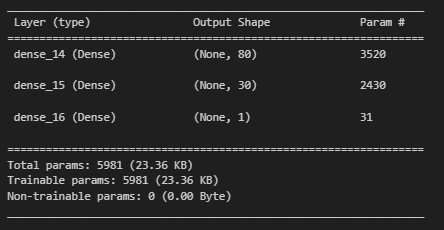
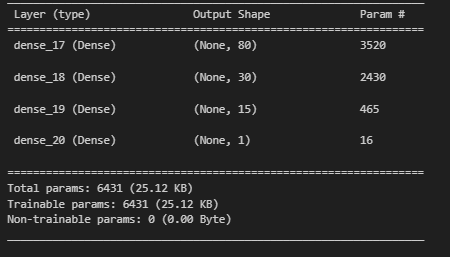
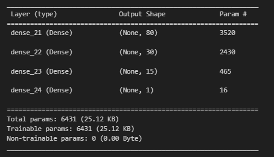
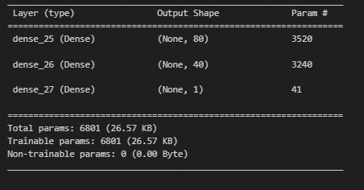

# Model Report 

## Purpose of Analysis: 
The purpose of this analysis was to create a machine learning model that can be used as a tool by the non-profit foundations to select applications for funding that have the best chance of success in their ventures. 

Results: Using bulleted lists and images to support your answers, address the following questions:

## Data Preprocessing 

Before building the models, the dataset provided was preprocessed using Pandas and StandardScaler(). The EIN and NAME columns were dropped as they were simply identification columns and are neither features nor targets. 

For the model, the variable 'IS_SUCCESSFUL' from the dataset which denotes whether the money was used effectively was used as the target. While the following features and what they denote were used as features: 
- APPLICATION_TYPE—Alphabet Soup application type
- AFFILIATION—Affiliated sector of industry
- CLASSIFICATION—Government organization classification
- USE_CASE—Use case for funding
- ORGANIZATION—Organization type
- STATUS—Active status
- INCOME_AMT—Income classification
- SPECIAL_CONSIDERATIONS—Special considerations for application
- ASK_AMT—Funding amount requested

## Compiling, Training, and Evaluating the Model

A neural network model was used to achieve our objective. For the very initial model, the following hyperparameters were used: 
- Number of layers: 2 hidden layers and 1 output layer. 
    - Based on the number of features (input_dim = 43), 2 hidden layers with one output layer were chosen as a good starting point.  

- Number of neurons: 80 for the first hidden layer, 30 for the second hidden layer, and 1 for the output layer. 
    - 80 neurons were chosen for the first hidden layer as an initial attempt based on the number of input features. 

- Activation functions: relu for the two hidden layers and sigmoid for the output layer. 

- Number of epochs: 100 epochs were chosen as a starting point for the model. 

From the initial attempt, the accuracy of the model was 72.57% with loss of 55.27%. Our aim was to acheive at least 75% predictive accuracy, therefore we made 3 attemps to optomize the model: 

1) Attempt 1: an additional hidden layer was added with neurons no. = 15, and increased the number of epochs to 150. 
    - Accuracy was at 72.59% and loss was 56.05%. 

2) Attempt 2: changing the activation function of the added hidden layer to 'tanh' and changing the number of epochs back to 100
    - Accuracy was at 72.49% and loss was 55.38%

3) Attempt 3: changing the number of hidden layers back to 2, increasing the number of epochs to 150, and increasing the number of neurons in the second hidden layer to 40
    - Accuracy was at 72.56% and loss was 56.50%

Desipite the attemps at optomization, the model did not achieve an accuracy of 75% or higher. 

## Summary 

A neural network model was built various configurations of layers, neurons, and activation functions. Despite several attempts at optimization, the model did not achieve the desired accuracy of 75% or higher. The highest accuracy achieved was 72.59% in the first optimization attempt, which involved adding an additional hidden layer and increasing the number of epochs to 150.
Based on the results, it appears that increasing the complexity of the model by adding more layers and training for more epochs yielded the best results. So, a recommendation for a different model would be to continue exploring this direction, perhaps by adding more hidden layers or increasing the number of neurons to existing layers. That being said, increasing the complexity of the model runs the risk of overfitting. So in addition to altering the model architecture, it's possible to revisit the data preprocessing stage. For example, decreasing the cutoff value for either the APPLICATION_TYPE or CLASSIFICATION variable would result in more bins that could potentially provide the model more information to capture. 
In conclusion, while the initial results were not as high as desired, there are alternative methods that can be explored for improving the model's performance. 

